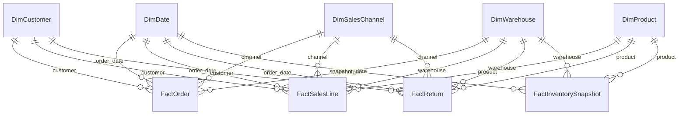

# Star schema

`FactOrder` also contains required, shipped and delivered date keys. Those relationships are inactive in the semantic model and can be used explicitly when a measure needs another date role.

Returns use the original order date as the active reporting date. The return date remains available as an inactive relationship.
